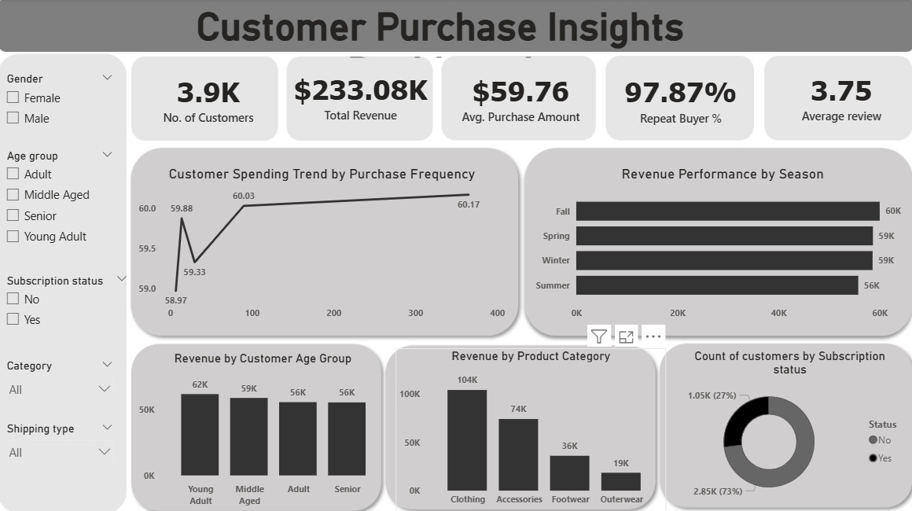

# customer-purchase-behavior-analysis
## Project Overview
This project presents an end-to-end data analytics workflow focused on understanding customer purchasing behavior in a retail environment. The goal is to analyze customer data to uncover insights related to revenue performance, purchasing patterns, demographic trends, and customer engagement.

The project simulates a real-world analytics pipeline by combining data cleaning, exploratory data analysis (EDA), SQL-based business analysis, and interactive dashboard visualization.

---

## Business Problem
Retail companies need to understand customer purchasing behavior in order to optimize marketing strategies, improve product offerings, and enhance customer engagement. By analyzing customer shopping data, this project aims to identify patterns and trends that influence revenue generation and customer loyalty.

---

## Tools and Technologies
- Python (Pandas, NumPy)
- Matplotlib
- Seaborn
- PostgreSQL
- SQL
- Power BI
- Jupyter Notebook

---

## Dataset Description
The dataset represents customer shopping behavior in a retail environment. Each row corresponds to a customer's purchase record and contains demographic information, product attributes, transaction details, and engagement indicators.

Key columns include:

- Customer ID  
- Age  
- Gender  
- Item Purchased  
- Category  
- Purchase Amount  
- Location  
- Size  
- Color  
- Season  
- Review Rating  
- Subscription Status  
- Shipping Type  
- Discount Applied  
- Payment Method  
- Previous Purchases  
- Purchase Frequency  

---

## Data Cleaning and Feature Engineering
Data preprocessing was performed using Python to prepare the dataset for analysis.

Key steps included:

- Handling missing values in review ratings using category-wise median imputation
- Standardizing column names for consistency
- Creating a new **age_group** column to segment customers into demographic groups
- Converting textual purchase frequency values into numeric **purchase_frequency_days**
- Removing redundant columns to avoid duplication
- Ensuring correct data types for numerical and categorical variables

These steps improved data quality and enabled deeper analysis.

---

## Exploratory Data Analysis (EDA)
Exploratory data analysis was conducted using **Matplotlib** and **Seaborn** to understand patterns within the dataset.

The analysis focused on:

- Distribution of purchase amounts
- Spending patterns across product categories
- Customer demographic trends
- Seasonal purchasing behavior
- Customer engagement patterns

Visualizations helped identify trends, correlations, and potential business insights before performing SQL-based analysis.

---

## SQL-Based Business Analysis
After preprocessing, the cleaned dataset was loaded into a **PostgreSQL database** for advanced analysis using SQL queries.

Key analytical tasks included:

- Revenue analysis by product category
- Revenue contribution by customer age group
- Seasonal revenue trends
- Customer segmentation based on previous purchases
- Identification of repeat buyers
- Evaluation of discount effectiveness
- Subscription behavior analysis

SQL aggregation functions, filtering conditions, and window functions were used to extract business insights from the dataset.

---

## Dashboard Development
An interactive **Power BI dashboard** was created to visualize the insights derived from the analysis.

### Key Performance Indicators (KPIs)

- Total number of customers
- Total revenue generated
- Average purchase amount
- Repeat buyer percentage
- Average review rating

### Visualizations

The dashboard includes the following analytical visualizations:

- Customer Spending Trend by Purchase Frequency
- Revenue Performance by Season
- Revenue by Product Category
- Revenue by Customer Age Group
- Customer Subscription Distribution

### Interactive Filters

The dashboard allows dynamic exploration using filters such as:

- Gender
- Age Group
- Category
- Shipping Type
- Subscription Status

---

## Dashboard Preview

---

## Key Insights

- Young adults generated the highest share of revenue among all customer segments.
- The clothing category contributed the largest portion of overall revenue.
- A large proportion of customers are repeat buyers, indicating strong retention.
- Revenue distribution remains relatively stable across different seasons.

---

## Author

**Suyash Sharma**
